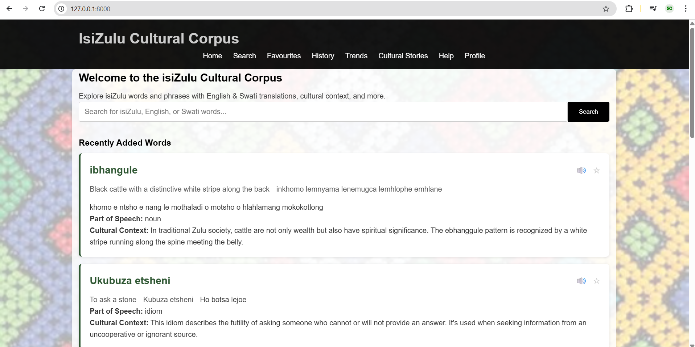
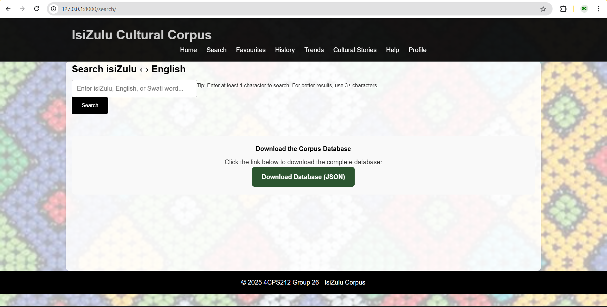
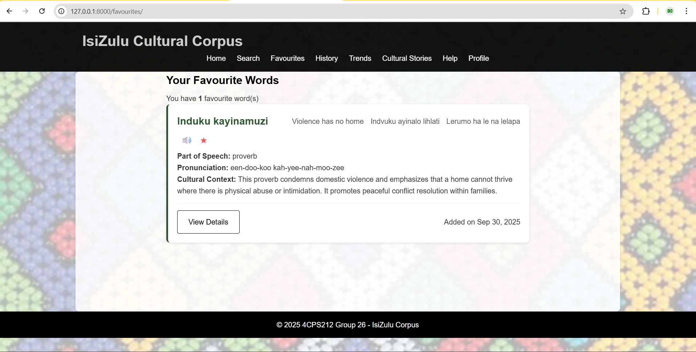
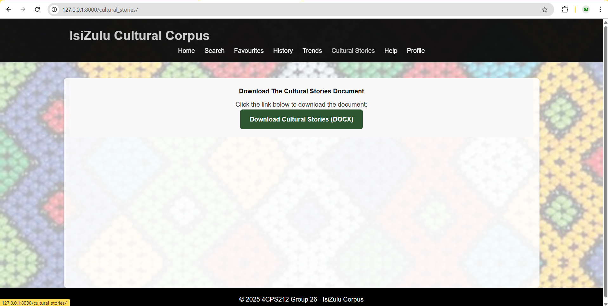
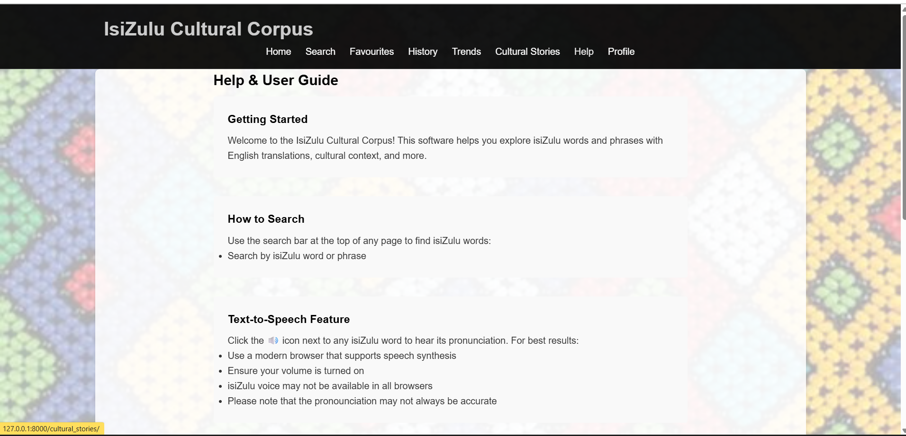
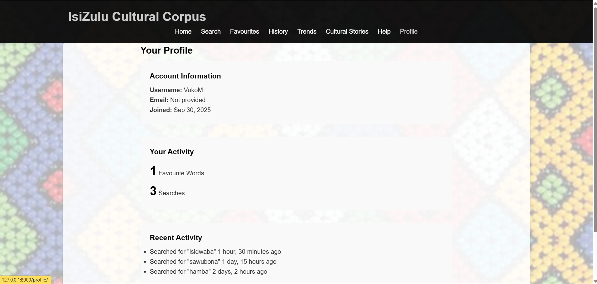

# isiZulu Cultural Corpus


A web-based platform that provides searchable isiZulu texts, translations, and linguistic insights for research, cultural preservation, and computational applications. Built with **Django** and designed to empower both researchers and developers working with African languages.

---

##  Overview

The **isiZulu Cultural Corpus** enables users to:

* Search isiZulu words, phrases, and translations
* Browse cultural stories and linguistic examples
* Analyze word usage, frequency, and trends
* Listen to words with integrated text-to-speech (TTS)
* Save and manage favorite words for quick access
* Download the full corpus in JSON format

---

##  Features

* 🔍 **Search**: Find isiZulu words and phrases with translations
* 📊 **Trends**: View graphs of most searched words and frequency statistics
* ⭐ **Favorites**: Save commonly used words
* 🕒 **History**: Access recent searches
* 📚 **Cultural Stories**: Explore traditional narratives
* 🗣 **Text-to-Speech (TTS)**: Hear correct pronunciation
* 📥 **Download Corpus Data**: Export isiZulu corpus as JSON

---

##  Technology Stack

* **Backend**: Python (Django)
* **Frontend**: HTML, CSS, JavaScript (Django templates)
* **Database**: SQLite
* **Format Support**: JSON for data export

---

##  Data Structure

The corpus database includes:

| Attribute                  | Type     | Description                         |
| -------------------------- | -------- | ----------------------------------- |
| `Zulu_word`                | String   | isiZulu word                        |
| `English_translation`      | String   | English equivalent                  |
| `Swati_translation`        | String   | siSwati equivalent                  |
| `Sotho_translation`        | String   | Sesotho equivalent                  |
| `Pronunciation_guide`      | String   | Phonetic guide for isiZulu word     |
| `Part_of_speech`           | String   | Grammatical role (noun, verb, etc.) |
| `Example_sentence_zulu`    | String   | Example usage in isiZulu            |
| `Example_sentence_english` | String   | Example usage in English            |
| `Date_added`               | DateTime | When the word was added             |

---

## 🚀 Getting Started

Clone this repository:

```bash
git clone https://github.com/vukomngomezulu/IsiZulu-Corpus.git
cd IsiZulu-Corpus
```

Install dependencies:

```bash
pip install -r requirements.txt
```

Run the development server:

```bash
python manage.py runserver
```

Access the app at:

```
http://127.0.0.1:8000/
```

---

## Screenshots

### Home



### Search



### Favorites



### History


### Trends


### Cultural Stories



### Help



### Profile



---

##  Testing

This project follows a layered testing approach:

*  Unit Testing – for individual functions and features
*  Integration Testing – for interactions across components
* System Testing – for full workflow validation
* Performance Testing - for system performance
---


##  License

This project is released under the MIT License.

---

## Authors

Group 26 – University Student Project

* Shandu A.N
* Zulu F.Z
* Mchunu C.P.P
* Zulu A.A.H
* Mngomezulu V.S
* Shabalala W.S
* Ngwenya S.M
* Zulu K

---

🌍 *“Preserving isiZulu, empowering technology.”*
